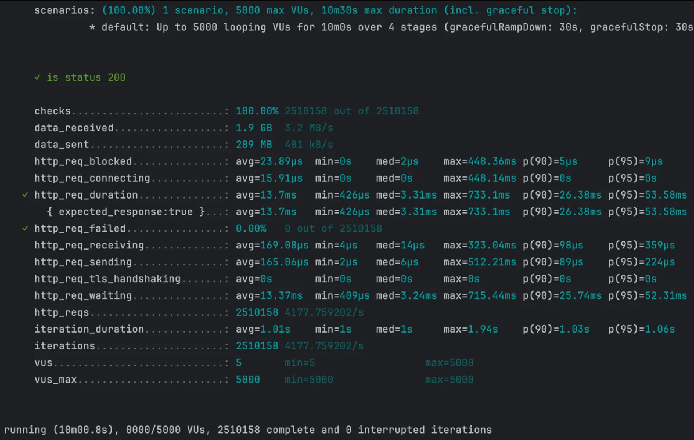

## [본 과정] 이커머스 핵심 프로세스 구현
[단기 스킬업 Redis 교육 과정](https://hh-skillup.oopy.io/) 을 통해 상품 조회 및 주문 과정을 구현하며 현업에서 발생하는 문제를 Redis의 핵심 기술을 통해 해결합니다.
> Indexing, Caching을 통한 성능 개선 / 단계별 락 구현을 통한 동시성 이슈 해결 (낙관적/비관적 락, 분산락 등)
---
# 모듈 구성
```
redis-1st
│
├── movie-domain                  ✅ 도메인 모듈 (핵심 비즈니스 로직)
│   └── src/main/java/com/example/domain
│       ├── model                 # 도메인 모델 (엔티티, 값 객체 등)
│       ├── converter             # 도메인 관련 유틸 (db 값 컨버터)
│       ├── validation            # 도메인 검증 로직
│       └── exception             # 도메인 예외 처리 (커스텀 익셉션, 에러 코드 등)
│
├── movie-application             ✅  애플리케이션 서비스 모듈
│   └── src/main/java/com/example/application
│       ├── port                  # 서비스/리포지토리 포트 (인터페이스)
│       ├── service               # 도메인 서비스 구현
│       ├── dto                   # 데이터 전송 객체 (DTO)
│       └── exception             # 애플리케이션 예외 처리 (핸들러)
│
├── movie-infrastructure          ✅  인프라스트럭처 모듈 + 애플리케이션 진입점
│   └── src/main/java/com/example/infrastructure
│       ├── web                   # 웹 관련 어댑터 (컨트롤러)
│       ├── persistence           # DB 어댑터 
│       ├── db                    # DB 구현체
│       │     └── querydsl   
│       └── config                # 설정 파일
│     
└──
```
- `movie-infrastructure` 모듈의 `infrastructureApplication`로 Spring Boot 애플리케이션을 실행합니다.
- `movie-infrastructure` 모듈의 `resources`에 application.yml, DDL 파일이 위치합니다.
- `redis-1st` 모듈의 `test`에 .http, loadTest.js 파일이 위치합니다.

### ✔️ 모듈 역할
`헥사고날 아키텍처`를 기반으로 한 멀티모듈 구성

#### movie-domain
- `도메인` 모듈은 다른 모듈에 의존하지 않습니다.
- 외부 기술의 저수준 변경사항으로부터 도메인을 지키는 헥사고날 아키텍처 원칙을 지향합니다.
- 단, 아키텍처가 생산성을 저하시키지 않도록 JPA 관련 의존성이 추가되었습니다.
- 도메인의 핵심 로직을 책임지는 엔티티, 값 객체, 예외, 변환기 등의 요소를 포함합니다.

#### movie-application 
- `애플리케이션` 모듈은 `도메인` 모듈에 의존합니다. 
- Inboud Port: 컨트롤러에서 DTO로 데이터를 주고 받을 때 호출할 서비스 포트를 제공합니다.
- Outbound Port: DB와 통신하기 위해 서비스 계층에서 호출할 리포지토리 포트를 정의합니다.

#### movie-infrastructure
- `인프라스트럭처` 모듈은 `애플리케이션` 모듈과 `도메인` 모듈에 의존합니다.
- 외부 시스템 및 DB와의 연결을 담당합니다.
- Persistence adapter: 저장소와 상호작용하기 위해 리포지토리 포트를 구현합니다.


# 테이블 디자인
- `Movie` (영화): 영화의 기본 정보 저장
- `Theater` (상영관): 상영관 정보를 관리
- `Screening` (상영 정보): movie_id, theater_id를 각각 외래키로 참조하며 영화와 상영관을 연결
- `Seat` (좌석 정보): theater_id를 외래키로 참조하여 각 상영관의 좌석 정보 저장
    - `SeatNumber`를 Embedded 타입으로 구성해 좌석 번호 관련 로직을 분리 
- `ContentRating` (상영 등급)을 Enum 으로 작성해 잘못된 값 입력을 방지
- 모든 엔티티는 `AuditingFields` 를 상속해 createdBy, createdAt, modifiedBy, modifiedAt 정보를 관리

### ️✔️️ 테이블 관계 설정
```
Screening (N) <-> Movie (1)
Screening (N) -> Theater (1)
Seat (N) -> Theater (1)
```

### ✔️ 데이터 설정
- `v1.0__initial_schema.sql`로 DB 스키마를 정의
- `data.sql`로 애플리케이션 시작 시 DB에 초기 데이터를 삽입

---
# 성능 테스트
## 1. 영화 목록 전체 조회 API

### 쿼리
- JPQL로 쿼리 작성, Entity Graph 적용
```sql
Hibernate: 
    select
        m1_0.id,
        m1_0.content_rating,
        m1_0.created_at,
        m1_0.created_by,
        m1_0.genre,
        m1_0.modified_at,
        m1_0.modified_by,
        m1_0.release_date,
        m1_0.runtime_minutes,
        s1_0.movie_id,
        s1_0.id,
        s1_0.created_at,
        s1_0.created_by,
        s1_0.end_time,
        s1_0.modified_at,
        s1_0.modified_by,
        s1_0.start_time,
        s1_0.theater_id,
        t1_0.id,
        t1_0.created_at,
        t1_0.created_by,
        t1_0.modified_at,
        t1_0.modified_by,
        t1_0.name,
        m1_0.thumbnail_url,
        m1_0.title 
    from
        movie m1_0 
    left join
        screening s1_0 
            on m1_0.id=s1_0.movie_id 
    left join
        theater t1_0 
            on t1_0.id=s1_0.theater_id 
    where
        m1_0.title like ? escape '!' 
        and m1_0.genre=? 
    order by
        m1_0.release_date desc,
        s1_0.start_time
```


### 실행 계획

| id | select\_type | table | partitions | type | possible\_keys | key | key\_len | ref | rows | filtered | Extra |
| --- | --- | --- | --- | --- | --- | --- | --- | --- | --- | --- | --- |
| 1 | SIMPLE | m1\_0 | null | ALL | null | null | null | null | 500 | 100 | Using temporary; Using filesort |
| 1 | SIMPLE | s1\_0 | null | ref | FKfp7sh76xc9m508stllspchnp9 | FKfp7sh76xc9m508stllspchnp9 | 8 | dev\_database.m1\_0.id | 3 | 100 | null |
| 1 | SIMPLE | t1\_0 | null | eq\_ref | PRIMARY | PRIMARY | 8 | dev\_database.s1\_0.theater\_id | 1 | 100 | null |
- **`movie` 테이블**
  - 인덱스를 사용하지 않고 **풀 테이블 스캔 (`ALL`)** 발생
  - 정렬 시 **임시 테이블(`Using temporary`) 및 파일 정렬(`Using filesort`)이 사용**되어 성능 저하
- **`screening` 테이블**
  - `movie_id` 컬럼을 기준으로 조인 시 **참조 인덱스(`ref`)** 사용
  - `FKfp7sh76xc9m508stllspchnp9` 인덱스를 활용하여 평균 **3개의 행을 조회**
- **`theater` 테이블**
  - 기본 키(`PRIMARY KEY`)를 사용한 **`eq_ref` 조인 방식** 적용
  - `theater_id`를 활용하여 **최적의 조인 방식이 적용된 상태로 성능 문제 없음**

### 부하 테스트 결과


- **평균 응답 시간:** `7.14s`
- **p(95) 응답 시간:** `14.28s` (목표 `200ms` 초과 ❌)
- **실패율 (`http_req_failed`):** `0.00%`
- **초당 처리 요청 수 (`RPS`):** `52.34 req/s`
- **최대 응답 시간:** `35.61s` (일부 요청에서 매우 긴 응답 발생 ❌)

## 2. 검색 기능이 추가된 API (Index 적용 전)

### 쿼리
- QueryDSL로 쿼리 작성
```sql
Hibernate: 
    select
        m1_0.id,
        m1_0.content_rating,
        m1_0.created_at,
        m1_0.created_by,
        m1_0.genre,
        m1_0.modified_at,
        m1_0.modified_by,
        m1_0.release_date,
        m1_0.runtime_minutes,
        s1_0.movie_id,
        s1_0.id,
        s1_0.created_at,
        s1_0.created_by,
        s1_0.end_time,
        s1_0.modified_at,
        s1_0.modified_by,
        s1_0.start_time,
        s1_0.theater_id,
        t1_0.id,
        t1_0.created_at,
        t1_0.created_by,
        t1_0.modified_at,
        t1_0.modified_by,
        t1_0.name,
        m1_0.thumbnail_url,
        m1_0.title 
    from
        movie m1_0 
    left join
        screening s1_0 
            on m1_0.id=s1_0.movie_id 
    left join
        theater t1_0 
            on t1_0.id=s1_0.theater_id 
    where
        lower(m1_0.title) like ? escape '!' 
        and m1_0.genre=? 
    order by
        m1_0.release_date desc,
        s1_0.start_time
```

### 실행 계획

| id | select\_type | table | partitions | type | possible\_keys | key | key\_len | ref | rows | filtered | Extra |
| --- | --- | --- | --- | --- | --- | --- | --- | --- | --- | --- | --- |
| 1 | SIMPLE | m1\_0 | null | ALL | null | null | null | null | 503 | 1.11 | Using where; Using temporary; Using filesort |
| 1 | SIMPLE | s1\_0 | null | ALL | null | null | null | null | 1501 | 100 | Using where; Using join buffer \(hash join\) |
| 1 | SIMPLE | t1\_0 | null | eq\_ref | PRIMARY | PRIMARY | 4 | dev\_database.s1\_0.theater\_id | 1 | 100 | null |
- **`movie` 테이블**
  - 인덱스를 사용하지 않고 **풀 테이블 스캔 (`ALL`)**  발생
  - 정렬 시 **임시 테이블(`Using temporary`) 및 파일 정렬(`Using filesort`)이 사용**되어 성능 저하
- **`screening` 테이블**
  - `movie_id` 컬럼에 적절한 인덱스가 없어 **풀 테이블 스캔 (`ALL`)** 발생
  - 조인 시 **해시 조인(`Using join buffer (hash join)`)이 사용**되어 성능 저하
- **`theater` 테이블**
  - 기본 키(`PRIMARY KEY`)를 사용한 **`eq_ref` 조인 방식** 적용

### 부하 테스트 결과

- **평균 응답 시간 (`http_req_duration`)**: `1.95s`
- **p(95) 응답 시간**: `3.1s`
- **최대 응답 시간**: `6.12s`
- **실패율 (`http_req_failed`)**: `0.00%`
- **초당 처리 요청 수 (`RPS`)**: `1437.79 req/s`
- **총 요청 수**: `863,994`

## 3. Index 적용 후

### 적용한 인덱스 DDL
```jsx
CREATE INDEX idx_movie_release_date ON movie (release_date);
CREATE INDEX idx_screening_start_time ON screening (movie_id, start_time);
CREATE INDEX idx_movie_title ON movie (title)
```

### 쿼리

**⭕️ Like 연산자 사용**
```sql
Hibernate: 
    select
        m1_0.id,
        m1_0.content_rating,
        m1_0.created_at,
        m1_0.created_by,
        m1_0.genre,
        m1_0.modified_at,
        m1_0.modified_by,
        m1_0.release_date,
        m1_0.runtime_minutes,
        s1_0.movie_id,
        s1_0.id,
        s1_0.created_at,
        s1_0.created_by,
        s1_0.end_time,
        s1_0.modified_at,
        s1_0.modified_by,
        s1_0.start_time,
        s1_0.theater_id,
        t1_0.id,
        t1_0.created_at,
        t1_0.created_by,
        t1_0.modified_at,
        t1_0.modified_by,
        t1_0.name,
        m1_0.thumbnail_url,
        m1_0.title 
    from
        movie m1_0 
    left join
        screening s1_0 
            on m1_0.id=s1_0.movie_id 
    left join
        theater t1_0 
            on t1_0.id=s1_0.theater_id 
    where
        m1_0.title like ? escape '!' 
        and m1_0.genre=? 
    order by
        m1_0.release_date desc,
        s1_0.start_time
        
```

**❌ Like 연산자 미사용**
``` sql
Hibernate: 
    select
        m1_0.id,
        m1_0.content_rating,
        m1_0.created_at,
        m1_0.created_by,
        m1_0.genre,
        m1_0.modified_at,
        m1_0.modified_by,
        m1_0.release_date,
        m1_0.runtime_minutes,
        s1_0.movie_id,
        s1_0.id,
        s1_0.created_at,
        s1_0.created_by,
        s1_0.end_time,
        s1_0.modified_at,
        s1_0.modified_by,
        s1_0.start_time,
        s1_0.theater_id,
        t1_0.id,
        t1_0.created_at,
        t1_0.created_by,
        t1_0.modified_at,
        t1_0.modified_by,
        t1_0.name,
        m1_0.thumbnail_url,
        m1_0.title 
    from
        movie m1_0 
    left join
        screening s1_0 
            on m1_0.id=s1_0.movie_id 
    left join
        theater t1_0 
            on t1_0.id=s1_0.theater_id 
    where
        m1_0.title=? 
        and m1_0.genre=? 
    order by
        m1_0.release_date desc,
        s1_0.start_time
```

### 실행 계획

**⭕️ Like 연산자 사용**

| id | select\_type | table | partitions | type | possible\_keys | key | key\_len | ref | rows | filtered | Extra |
| --- | --- | --- | --- | --- | --- | --- | --- | --- | --- | --- | --- |
| 1 | SIMPLE | m1\_0 | null | range | idx\_movie\_title | idx\_movie\_title | 602 | null | 1 | 10 | Using index condition; Using where; Using temporary; Using filesort |
| 1 | SIMPLE | s1\_0 | null | ref | idx\_screening\_start\_time | idx\_screening\_start\_time | 4 | dev\_database.m1\_0.id | 2 | 100 | null |
| 1 | SIMPLE | t1\_0 | null | eq\_ref | PRIMARY | PRIMARY | 4 | dev\_database.s1\_0.theater\_id | 1 | 100 | null |
- **`movie` 테이블**
  - **인덱스(`idx_movie_title`) 활용 (`range` 검색)**
  - **임시 테이블(`Using temporary`) 및 파일 정렬(`Using filesort`) 발생**
- **`screening` 테이블**
  - **`movie_id` 기반 `ref` 검색  → 인덱스(`idx_screening_start_time`) 정상 적용**
- **`theater` 테이블**
  - 기본 키(`PRIMARY KEY`)를 사용한 **`eq_ref` 조인 방식** 적용

**❌ Like 연산자 미사용**

| id | select\_type | table | partitions | type | possible\_keys | key | key\_len | ref | rows | filtered | Extra |
| --- | --- | --- | --- | --- | --- | --- | --- | --- | --- | --- | --- |
| 1 | SIMPLE | m1\_0 | null | ref | idx\_movie\_title | idx\_movie\_title | 602 | const | 1 | 10 | Using where; Using temporary; Using filesort |
| 1 | SIMPLE | s1\_0 | null | ref | idx\_screening\_start\_time | idx\_screening\_start\_time | 4 | dev\_database.m1\_0.id | 2 | 100 | null |
| 1 | SIMPLE | t1\_0 | null | eq\_ref | PRIMARY | PRIMARY | 4 | dev\_database.s1\_0.theater\_id | 1 | 100 | null |
- **`movie` 테이블**
  - **접근 방식 변경:** `range` → `ref`
  - **`ref` 값 변경:** `null` → `const`

### 부하 테스트 결과

**⭕️ Like 연산자 사용**

- **평균 응답 시간 (`http_req_duration`)**: `1.24s` **(인덱스 적용 전과 비교했을 때 36.4% 감소 ✅)**
- **p(95) 응답 시간**: `2.43s` **(21.6% 감소 ✅)**
- **최대 응답 시간**: `5.25s` **(14.2% 감소 ✅)**
- **실패율 (`http_req_failed`)**: `0.00%`
- **초당 처리 요청 수 (`RPS`)**: `1895.07 req/s` **(31.7% 증가 ✅)**
- **총 요청 수**: `1,134,866`

**❌ Like 연산자 미사용**

- **평균 응답 시간 (`http_req_duration`)**: `1.93s` **(like 사용할 때 보다 증가 ⬆️)**
- **p(95) 응답 시간**: `3.14s` **(증가 ⬆️)**
- **최대 응답 시간**: `6.27s` **(증가 ⬆️)**
- **실패율 (`http_req_failed`)**: `0.00%` **(성공)**
- **초당 요청 처리량 (`RPS`)**: `1449.83 req/s` **(감소 ⬇️)**
- **총 요청 수**: `871,069` **(감소 ⬇️)**


# 4. 로컬 Caching 적용 후

- Like 연산자 사용 + index 적용
- 
### 캐싱한 데이터의 종류
- `title-genre` 조합에 해당하는 `List<MovieResponseDto>` 데이터를 캐싱
- **Key:** `title` + `genre` → `"in-SCI_FI"` 같은 조합 (Query Parameter 기반)
- **Value:** `List<MovieResponseDto>` (특정 제목과 장르에 해당하는 영화 목록)

### 실행 계획
- 쿼리 실행 계획은 이전과 동일

### 부하 테스트 결과


- **평균 응답 시간 (`http_req_duration`)**: `6.84ms` (**캐싱 적용 전보다 ⏬ 99.64% 감소**)
- **p(95) 응답 시간**: `26.06ms` (**⏬ 99.2% 감소**)
- **최대 응답 시간**: `370.18ms` (**⏬ 94.1% 감소**)
- **실패율 (`http_req_failed`)**: `0.00%`
- **초당 요청 처리량 (`RPS`)**: `4206.66 req/s` (**⏫ 190% 증가**)
- **총 요청 수**: `2,525,659` (**⏫ 190% 증가**)
# 5. 분산 Caching 적용 후

- Caffeine에서 Redis로 변경
- 캐싱한 데이터 종류, 실행 계획은 이전과 동일

### 부하 테스트 결과

- **평균 응답 시간 (`http_req_duration`)**: `13.7ms` **(로컬 캐싱 적용 결과 보다는 느려짐 ⬇️)**
- **p(95) 응답 시간**: `53.58ms`
- **최대 응답 시간**: `733.1ms`
- **실패율 (`http_req_failed`)**: `0.00%`
- **초당 요청 처리량 (`RPS`)**: `4177.76 req/s`
- **총 요청 수**: `2,510,158`