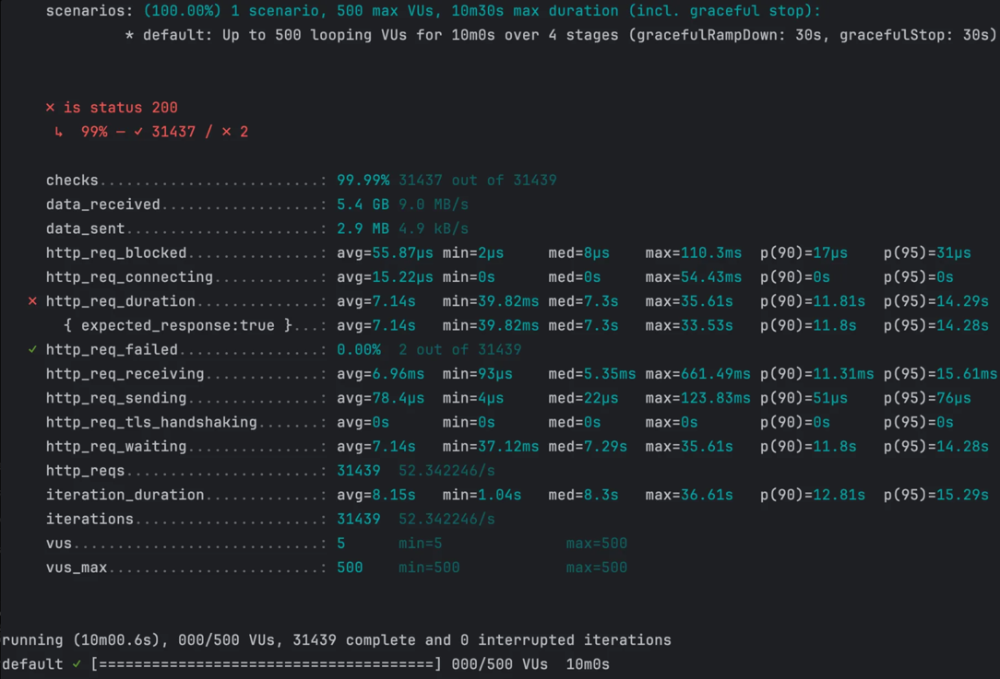
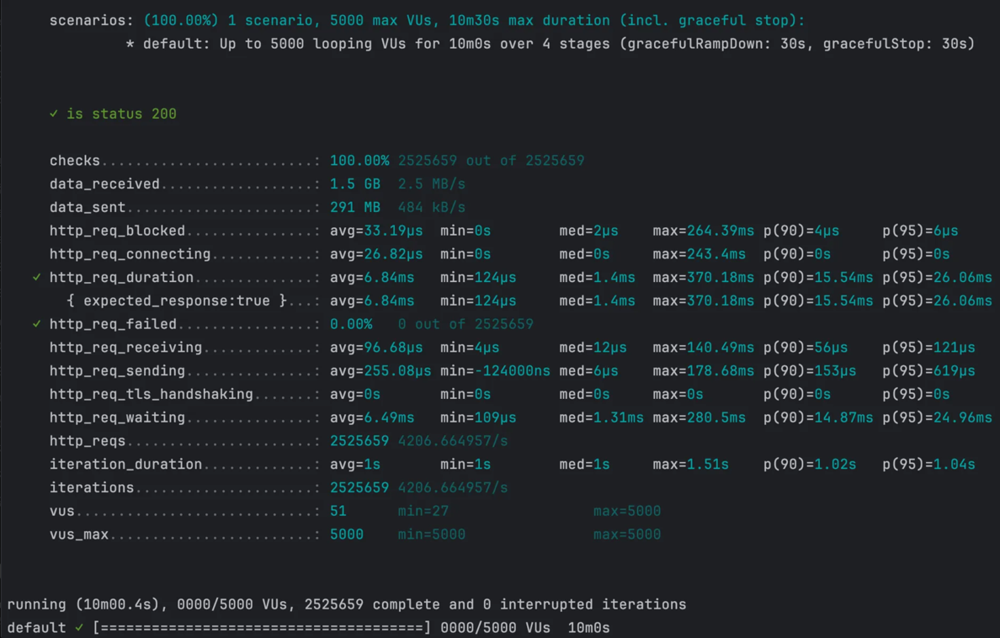
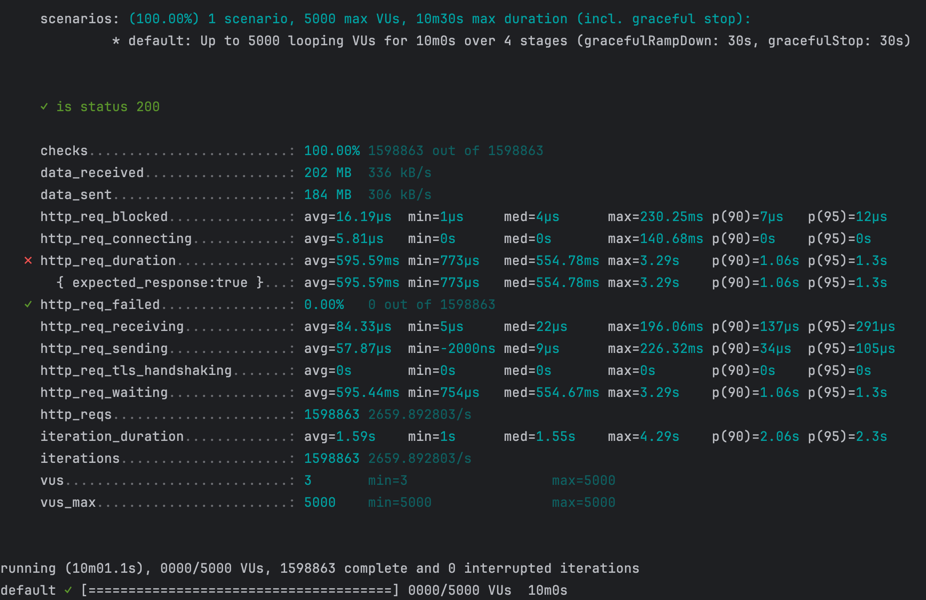
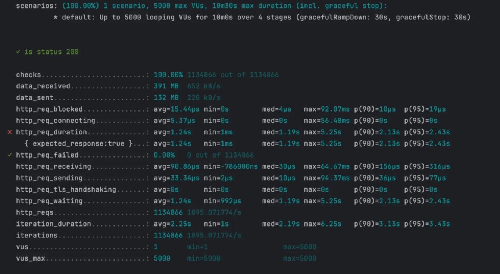
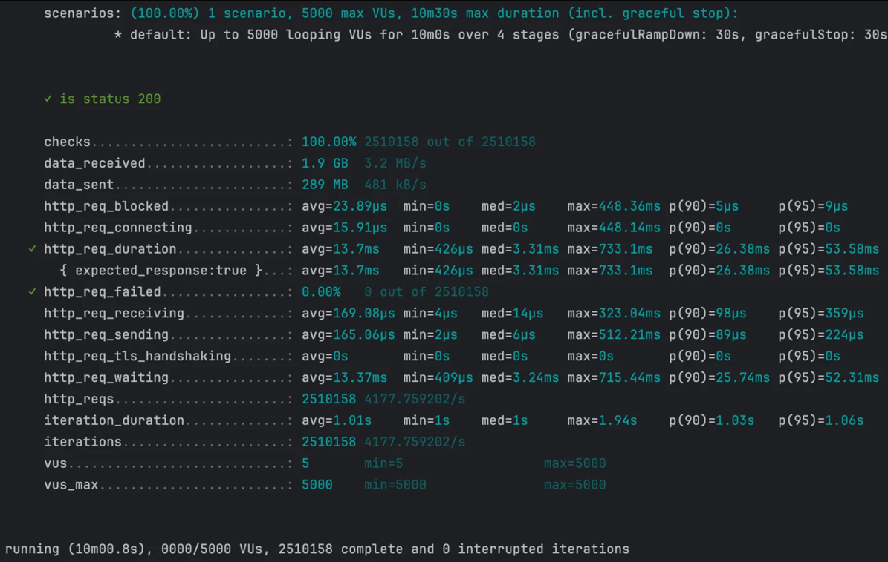

## [본 과정] 이커머스 핵심 프로세스 구현
[단기 스킬업 Redis 교육 과정](https://hh-skillup.oopy.io/) 을 통해 상품 조회 및 주문 과정을 구현하며 현업에서 발생하는 문제를 Redis의 핵심 기술을 통해 해결합니다.
> Indexing, Caching을 통한 성능 개선 / 단계별 락 구현을 통한 동시성 이슈 해결 (낙관적/비관적 락, 분산락 등)
---
# 모듈 구성
```
redis-1st
│
├── movie-domain                  ✅ 도메인 모듈 (핵심 비즈니스 로직)
│   └── src/main/java/com/example/domain
│       ├── model                 # 도메인 모델 (엔티티, 값 객체 등)
│       ├── converter             # 도메인 관련 유틸 (db 값 컨버터)
│       ├── validation            # 도메인 검증 로직
│       └── exception             # 도메인 예외 처리 (커스텀 익셉션, 에러 코드 등)
│
├── movie-application             ✅  애플리케이션 서비스 모듈
│   └── src/main/java/com/example/application
│       ├── port                  # 서비스/리포지토리 포트 (인터페이스)
│       ├── service               # 도메인 서비스 구현
│       ├── dto                   # 데이터 전송 객체 (DTO)
│       └── exception             # 애플리케이션 예외 처리 (핸들러)
│
├── movie-infrastructure          ✅  인프라스트럭처 모듈 + 애플리케이션 진입점
│   └── src/main/java/com/example/infrastructure
│       ├── web                   # 웹 관련 어댑터 (컨트롤러)
│       ├── persistence           # DB 어댑터 
│       ├── db                    # DB 구현체
│       │     └── querydsl   
│       └── config                # 설정 파일
│     
└──
```
- `movie-infrastructure` 모듈의 `infrastructureApplication`로 Spring Boot 애플리케이션을 실행합니다.
- `movie-infrastructure` 모듈의 `resources`에 application.yml, DDL 파일이 위치합니다.
- `redis-1st` 모듈의 `test`에 .http, loadTest.js 파일이 위치합니다.

### ✔️ 모듈 역할
`헥사고날 아키텍처`를 기반으로 한 멀티모듈 구성

#### movie-domain
- `도메인` 모듈은 다른 모듈에 의존하지 않습니다.
- 외부 기술의 저수준 변경사항으로부터 도메인을 지키는 헥사고날 아키텍처 원칙을 지향합니다.
- 단, 아키텍처가 생산성을 저하시키지 않도록 JPA 관련 의존성이 추가되었습니다.
- 도메인의 핵심 로직을 책임지는 엔티티, 값 객체, 예외, 변환기 등의 요소를 포함합니다.

#### movie-application 
- `애플리케이션` 모듈은 `도메인` 모듈에 의존합니다. 
- Inboud Port: 컨트롤러에서 DTO로 데이터를 주고 받을 때 호출할 서비스 포트를 제공합니다.
- Outbound Port: DB와 통신하기 위해 서비스 계층에서 호출할 리포지토리 포트를 정의합니다.

#### movie-infrastructure
- `인프라스트럭처` 모듈은 `애플리케이션` 모듈과 `도메인` 모듈에 의존합니다.
- 외부 시스템 및 DB와의 연결을 담당합니다.
- Persistence adapter: 저장소와 상호작용하기 위해 리포지토리 포트를 구현합니다.


# 테이블 디자인
- members:	회원 정보를 저장 (이름, 이메일 등)
- movies:	영화 기본 정보를 저장 (제목, 장르, 개봉일 등)
- theaters:	상영관 정보를 저장 (상영관 이름)
- screenings:	특정 영화가 특정 상영관에서 언제 상영되는지 저장 (시작 시간, 종료 시간)
- seats:	각 극장의 좌석 정보를 저장 (총 25개 좌석)
- screeningSeat:	특정 상영 시간의 좌석을 관리하고 예약 여부를 체크
- reservation:	회원이 특정 상영 시간에 대해 예약한 정보를 저장
- reservedSeat:	예약(reservation)과 상영 좌석(screeningSeat)을 연결하는 N:M 관계 테이블

### ️✔️️ 테이블 관계 설정

| 관계 | 설명 |
|------|------|
| `Screening (N) -> Movie (1)` | 하나의 영화(Movie)는 여러 상영(Screening)에서 사용될 수 있음. |
| `Screening (N) -> Theater (1)` | 하나의 극장(Theater)에서는 여러 상영(Screening)이 이루어질 수 있음. |
| `Seat (N) -> Theater (1)` | 하나의 극장(Theater)에는 여러 좌석(Seat)이 존재함. |
| `Reservation (N) -> Screening (1)` | 하나의 상영(Screening)에 대해 여러 개의 예약(Reservation)이 발생할 수 있음. |
| `Reservation (N) -> Member (1)` | 하나의 회원(Member)은 여러 개의 예약(Reservation)을 가질 수 있음. |
| `ScreeningSeat (N) -> Screening (1)` | 하나의 상영(Screening)은 여러 좌석(ScreeningSeat)과 연결됨. |
| `ScreeningSeat (N) -> Seat (1)` | 하나의 좌석(Seat)은 여러 상영(ScreeningSeat)에 포함될 수 있음. |
| `ReservedSeat (N) -> Reservation (1)` | 하나의 예약(Reservation)에는 여러 좌석(ReservedSeat)이 포함될 수 있음. |
| `ReservedSeat (N) -> ScreeningSeat (1)` | 하나의 좌석(ScreeningSeat)은 여러 예약(ReservedSeat)에서 사용될 수 있음. |


### ✔️ 데이터 설정
- `v1.0__initial_schema.sql`로 DB 스키마를 정의
- `data.sql`로 애플리케이션 시작 시 DB에 초기 데이터를 삽입

---
# 성능 테스트
> 5,000명 사용자의 최대 부하를 견딜 수 있는지 10분 동안 테스트
- **DAU**: 5,000명
- **목적:** 하루 **5,000명 사용자가 피크 트래픽(최대 10배)** 상황에서 API 성능 검증
- **부하 패턴:** **2분 동안 5,000명까지 증가 → 5분 유지 → 2분 유지 → 1분 종료**
- **성능 기준:** **상위 95% 요청이 응답 시간 200ms 이하, 실패율 1% 미만**
- **테스트 대상:** 
    - 전체 조회:`/api/v1/movies`
    - 검색 조회: `/api/v1/movies?title='검색어'&genre='장르명'`

## 1. 영화 목록 전체 조회 API

> JPQL로 쿼리 작성, Entity Graph 적용
### 쿼리
```sql
Hibernate: 
    select
        m1_0.id,
        m1_0.content_rating,
        m1_0.created_at,
        m1_0.created_by,
        m1_0.genre,
        m1_0.modified_at,
        m1_0.modified_by,
        m1_0.release_date,
        m1_0.runtime_minutes,
        s1_0.movie_id,
        s1_0.id,
        s1_0.created_at,
        s1_0.created_by,
        s1_0.end_time,
        s1_0.modified_at,
        s1_0.modified_by,
        s1_0.start_time,
        s1_0.theater_id,
        t1_0.id,
        t1_0.created_at,
        t1_0.created_by,
        t1_0.modified_at,
        t1_0.modified_by,
        t1_0.name,
        m1_0.thumbnail_url,
        m1_0.title 
    from
        movie m1_0 
    left join
        screening s1_0 
            on m1_0.id=s1_0.movie_id 
    left join
        theater t1_0 
            on t1_0.id=s1_0.theater_id 
    where
        m1_0.title like ? escape '!' 
        and m1_0.genre=? 
    order by
        m1_0.release_date desc,
        s1_0.start_time
```


### 실행 계획

| id | select\_type | table | partitions | type | possible\_keys | key | key\_len | ref | rows | filtered | Extra |
| --- | --- | --- | --- | --- | --- | --- | --- | --- | --- | --- | --- |
| 1 | SIMPLE | m1\_0 | null | ALL | null | null | null | null | 500 | 100 | Using temporary; Using filesort |
| 1 | SIMPLE | s1\_0 | null | ref | FKfp7sh76xc9m508stllspchnp9 | FKfp7sh76xc9m508stllspchnp9 | 8 | dev\_database.m1\_0.id | 3 | 100 | null |
| 1 | SIMPLE | t1\_0 | null | eq\_ref | PRIMARY | PRIMARY | 8 | dev\_database.s1\_0.theater\_id | 1 | 100 | null |
- **`movie` 테이블**
  - 인덱스를 사용하지 않고 **풀 테이블 스캔 (`ALL`)** 발생
  - 정렬 시 **임시 테이블(`Using temporary`) 및 파일 정렬(`Using filesort`)이 사용**되어 성능 저하
- **`screening` 테이블**
  - `movie_id` 컬럼을 기준으로 조인 시 **참조 인덱스(`ref`)** 사용
  - `FKfp7sh76xc9m508stllspchnp9` 인덱스를 활용하여 평균 **3개의 행을 조회**
- **`theater` 테이블**
  - 기본 키(`PRIMARY KEY`)를 사용한 **`eq_ref` 조인 방식** 적용
  - `theater_id`를 활용하여 **최적의 조인 방식이 적용된 상태로 성능 문제 없음**

### 부하 테스트 결과


- VU: 500
- **평균 응답 시간:** `7.14s`
- **p(95) 응답 시간:** `14.28s` (목표 `200ms` 초과 ❌)
- **실패율 (`http_req_failed`):** `0.00%`
- **초당 처리 요청 수 (`RPS`):** `52.34 req/s`
- **최대 응답 시간:** `35.61s` (일부 요청에서 매우 긴 응답 발생 ❌)

## 2. 검색 기능이 추가된 API (Index 적용 전)
> 기존 전체 목록 조회에 검색 기능을 추가, QueryDSL로 동적 쿼리 작성
### 쿼리
```sql
Hibernate: 
    select
        m1_0.id,
        m1_0.content_rating,
        m1_0.created_at,
        m1_0.created_by,
        m1_0.genre,
        m1_0.modified_at,
        m1_0.modified_by,
        m1_0.release_date,
        m1_0.runtime_minutes,
        s1_0.movie_id,
        s1_0.id,
        s1_0.created_at,
        s1_0.created_by,
        s1_0.end_time,
        s1_0.modified_at,
        s1_0.modified_by,
        s1_0.start_time,
        s1_0.theater_id,
        t1_0.id,
        t1_0.created_at,
        t1_0.created_by,
        t1_0.modified_at,
        t1_0.modified_by,
        t1_0.name,
        m1_0.thumbnail_url,
        m1_0.title 
    from
        movie m1_0 
    left join
        screening s1_0 
            on m1_0.id=s1_0.movie_id 
    left join
        theater t1_0 
            on t1_0.id=s1_0.theater_id 
    where
        lower(m1_0.title) like ? escape '!' 
        and m1_0.genre=? 
    order by
        m1_0.release_date desc,
        s1_0.start_time
```

### 실행 계획

| id | select\_type | table | partitions | type | possible\_keys | key | key\_len | ref | rows | filtered | Extra |
| --- | --- | --- | --- | --- | --- | --- | --- | --- | --- | --- | --- |
| 1 | SIMPLE | m1\_0 | null | ALL | null | null | null | null | 503 | 1.11 | Using where; Using temporary; Using filesort |
| 1 | SIMPLE | s1\_0 | null | ALL | null | null | null | null | 1501 | 100 | Using where; Using join buffer \(hash join\) |
| 1 | SIMPLE | t1\_0 | null | eq\_ref | PRIMARY | PRIMARY | 4 | dev\_database.s1\_0.theater\_id | 1 | 100 | null |
- **`movie` 테이블**: 인덱스를 사용하지 않고 **Full Table Scan (`ALL`)**  발생
- **`screening` 테이블**: `movie_id` 컬럼에 적절한 인덱스가 없어 **Full Table Scan (`ALL`)** 발생
- **`theater` 테이블**: 기본 키(`PRIMARY KEY`)를 사용한 PK 기반 단일 조회

### 부하 테스트 결과

- **평균 응답 시간 (`http_req_duration`)**: `1.95s` 
- **p(95) 응답 시간**: `3.1s` (목표 200ms 초과 ❌)
- **최대 응답 시간**: `6.12s`
- **실패율 (`http_req_failed`)**: `0.00%`
- **초당 처리 요청 수 (`RPS`)**: `1437.79 req/s`
- **총 요청 수**: `863,994`

## 3. Index 적용 후
### 적용한 인덱스 DDL
```jsx
-- 아래 두 가지 복합 인덱스를 생성 후 각각 차이를 확인
-- 1. title, genre 순으로 복합 인덱스 생성
CREATE INDEX idx_title_genre ON dev_database.movie (title, genre);
-- 2. genre, title 순으로 복합 인덱스 생성
CREATE INDEX idx_genre_title ON dev_database.movie (genre, title);

-- 모든 경우에 screening 테이블의 풀 스캔을 막기 위해 movie_id에 인덱스 생성
CREATE INDEX idx_screening_movie_id ON screening (movie_id);
```

### 3-1. ❌ Like 연산자 미사용 

### 쿼리
``` sql
Hibernate: 
    select
        m1_0.id,
        m1_0.content_rating,
        m1_0.created_at,
        m1_0.created_by,
        m1_0.genre,
        m1_0.modified_at,
        m1_0.modified_by,
        m1_0.release_date,
        m1_0.runtime_minutes,
        s1_0.movie_id,
        s1_0.id,
        s1_0.created_at,
        s1_0.created_by,
        s1_0.end_time,
        s1_0.modified_at,
        s1_0.modified_by,
        s1_0.start_time,
        s1_0.theater_id,
        t1_0.id,
        t1_0.created_at,
        t1_0.created_by,
        t1_0.modified_at,
        t1_0.modified_by,
        t1_0.name,
        m1_0.thumbnail_url,
        m1_0.title 
    from
        movie m1_0 
    left join
        screening s1_0 
            on m1_0.id=s1_0.movie_id 
    left join
        theater t1_0 
            on t1_0.id=s1_0.theater_id 
    where
        m1_0.title=? 
        and m1_0.genre=? 
    order by
        m1_0.release_date desc,
        s1_0.start_time
```
### 실행 계획

- **복합 인덱스에서 `title`과 `genre`순서와 상관없이 동일한 실행 계획이 출력됨**

| id | select\_type | table | partitions | type | possible\_keys | key | key\_len | ref | rows | filtered | Extra |
| :--- | :--- | :--- | :--- | :--- | :--- | :--- | :--- | :--- | :--- | :--- | :--- |
| 1 | SIMPLE | m1\_0 | null | ref | idx\_title\_genre | idx\_title\_genre | 603 | const,const | 1 | 100 | Using temporary; Using filesort |
| 1 | SIMPLE | s1\_0 | null | ref | idx\_screening\_movie\_id | idx\_screening\_movie\_id | 4 | dev\_database.m1\_0.id | 2 | 100 | null |
| 1 | SIMPLE | t1\_0 | null | eq\_ref | PRIMARY | PRIMARY | 4 | dev\_database.s1\_0.theater\_id | 1 | 100 | null |
#### 📌 실행 계획 분석
- `movie` 테이블: title + genre 인덱스 사용, 1건 조회 (✅ 최적화됨)
- `screening` 테이블: movie_id 인덱스 사용, 2건 조회 (✅ 최적화됨)
- `theater` 테이블: 기본키 검색, 1건 조회 (✅ 완벽 최적화)
### 부하 테스트 결과

- **평균 응답 시간** (`http_req_duration`): 595.59ms 
- **p(95) 응답 시간**: `1.3s` 
- **최대 응답 시간**: `3.29s` 
- 실패율 (`http_req_failed`): `0.00%`
- 초당 처리 요청 수 (`RPS`): `2659.89 req/s`
- 총 요청 수: `1,598,863`
- **✅ 평균 응답 속도가 69% 이상 감소하여 성능이 크게 개선**
- **✅ 처리량(RPS)과 총 요청 수도 약 85% 증가** 
- **❌ 아직 p(95)가 1.3s로 목표(200ms)보다 높지만, 인덱스 사용 전보다 58% 감소**

### 3-2. ⭕️ Like 연산자 사용

### 쿼리
```sql
Hibernate: 
    select
        m1_0.id,
        m1_0.content_rating,
        m1_0.created_at,
        m1_0.created_by,
        m1_0.genre,
        m1_0.modified_at,
        m1_0.modified_by,
        m1_0.release_date,
        m1_0.runtime_minutes,
        s1_0.movie_id,
        s1_0.id,
        s1_0.created_at,
        s1_0.created_by,
        s1_0.end_time,
        s1_0.modified_at,
        s1_0.modified_by,
        s1_0.start_time,
        s1_0.theater_id,
        t1_0.id,
        t1_0.created_at,
        t1_0.created_by,
        t1_0.modified_at,
        t1_0.modified_by,
        t1_0.name,
        m1_0.thumbnail_url,
        m1_0.title 
    from
        movie m1_0 
    left join
        screening s1_0 
            on m1_0.id=s1_0.movie_id 
    left join
        theater t1_0 
            on t1_0.id=s1_0.theater_id 
    where
        m1_0.title like ? escape '!' 
        and m1_0.genre=? 
    order by
        m1_0.release_date desc,
        s1_0.start_time
        
```


### 실행 계획

- **복합 인덱스에서 `title`과 `genre`순서와 상관없이 동일한 실행 계획이 출력됨**

| id | select\_type | table | partitions | type | possible\_keys | key | key\_len | ref | rows | filtered | Extra |
   | :--- | :--- | :--- | :--- | :--- | :--- | :--- | :--- | :--- | :--- | :--- | :--- |
   | 1 | SIMPLE | m1\_0 | null | range | idx\_title\_genre | idx\_title\_genre | 603 | null | 1 | 100 | Using index condition; Using temporary; Using filesort |
   | 1 | SIMPLE | s1\_0 | null | ref | idx\_screening\_movie\_id | idx\_screening\_movie\_id | 4 | dev\_database.m1\_0.id | 2 | 100 | null |
   | 1 | SIMPLE | t1\_0 | null | eq\_ref | PRIMARY | PRIMARY | 4 | dev\_database.s1\_0.theater\_id | 1 | 100 | null |

#### 📌 실행 계획 분석

- **`movie` 테이블에서 `type = range` 사용** → ⚠️ **인덱스를 활용한 범위 검색이 적용됨**
- **`key = idx_title_genre (title, genre)`** → ✅ **복합 인덱스를 활용하여 검색 진행됨**
- **`Using index condition`이 발생** → ⚠️ **인덱스에서 일부 필터링을 수행했지만, 전체 필터링이 인덱스에서 해결되지 않았음**
  - 일부 필터링은 인덱스에서 수행되었고, 나머지는 테이블 데이터를 조회하여 처리됨
  - 옵티마이저가 인덱스를 최적화하여 **Full Table Scan을 방지**한 것으로 보임

#### 📌 추가 최적화 가능성
- 현재 `title` 검색에 `LIKE` 연산자를 사용하며 `title + genre` 복합 인덱스를 생성한 상태
- Join 비용 절감을 위한 방안이었지만 검색키 세분화로 과도한 캐시키가 생성될 수 있는 상태
1. `title` 또는 `genre` 단독 검색이 자주 발생할 가능성이 있다면, 단독 인덱스 추가 고려
    - **`genre` 단독 인덱스 (`idx_genre`) 추가**
       - ✅ `WHERE genre = 'Action'`과 같은 단독 검색에서 범위 검색(`range`)이 아닌 **인덱스 검색(`ref`)이 적용될 수 있음**
    - **`title` 단독 인덱스 (`idx_title`) 추가**
      - 현재는 일반 B-TREE 인덱스(`idx_title`)를 추가해도 `LIKE '%검색어%'` 쿼리를 사용하기 때문에 인덱스 미적용
      - ✅`LIKE '검색어%'` (접두사 검색)으로 변경해 B-TREE 인덱스를 적용할 수 있음
      - ✅`FULLTEXT INDEX`를 적용해 `LIKE '%검색어%'` 검색 최적화 가능
2. 캐싱을 도입한 최적화 고려
    - 장르 단위 캐싱 → 검색 범위를 좁혀 불필요한 쿼리 수행을 줄임 
    - 전체 데이터 캐싱 후 필터링 → 응답 속도를 개선하고 데이터베이스 부하를 줄일 수 있음

### 부하 테스트 결과


- **평균 응답 시간 (`http_req_duration`)**: `1.24s`
- **p(95) 응답 시간**: `2.43s` 
- **최대 응답 시간**: `5.25s` 
- **실패율 (`http_req_failed`)**: `0.00%`
- **초당 처리 요청 수 (`RPS`)**: `1895.07 req/s` 
- **총 요청 수**: `1,134,866`
- **⚠️ Like 연산자 미사용 결과와 비교했을 때 전반적인 성능 저하가 나타남**


# 4. 로컬 Caching 적용 후

- Like 연산자 사용 + index 적용

### 캐싱한 데이터의 종류
- `title-genre` 조합에 해당하는 `List<MovieResponseDto>` 데이터를 캐싱
- **Key:** `title` + `genre` → `"in-SCI_FI"` 같은 조합 (Query Parameter 기반)
- **Value:** `List<MovieResponseDto>` (특정 제목과 장르에 해당하는 영화 목록)

### 실행 계획
- 쿼리 실행 계획은 이전과 동일


### 부하 테스트 결과


- **평균 응답 시간 (`http_req_duration`)**: `6.84ms` (**캐싱 적용 전보다 ⏬ 99.64% 감소**)
- **p(95) 응답 시간**: `26.06ms` (**⏬ 99.2% 감소**)
- **최대 응답 시간**: `370.18ms` (**⏬ 94.1% 감소**)
- **실패율 (`http_req_failed`)**: `0.00%`
- **초당 요청 처리량 (`RPS`)**: `4206.66 req/s` (**⏫ 190% 증가**)
- **총 요청 수**: `2,525,659` (**⏫ 190% 증가**)


# 5. 분산 Caching 적용 후

- Caffeine에서 Redis로 변경
- 캐싱한 데이터 종류, 실행 계획은 이전과 동일

### 부하 테스트 결과

- **평균 응답 시간 (`http_req_duration`)**: `13.7ms` **(로컬 캐싱 적용 결과 보다는 느려짐 ⬇️)**
- **p(95) 응답 시간**: `53.58ms`
- **최대 응답 시간**: `733.1ms`
- **실패율 (`http_req_failed`)**: `0.00%`
- **초당 요청 처리량 (`RPS`)**: `4177.76 req/s`
- **총 요청 수**: `2,510,158`