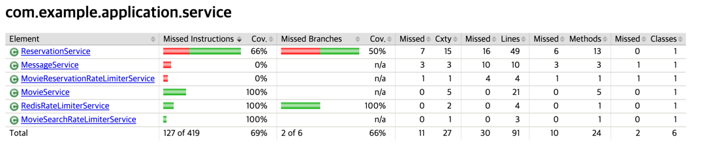

# 🎬 영화 조회 및 예약 API
>여러 사용자가 동시에 좌석을 예약하는 상황에서 발생하는 동시성 문제를 해결하고, 대량의 데이터를 빠르게 조회할 수 있도록 성능을 최적화하는 데 중점을 둔 API입니다.

## 기술 스택
- Spring Boot 3.4.1
- Spring Data JPA
- Java 21
- Gradle
- MySQL
- Querydsl
- Docker
- IntelliJ HTTP Request
- Jacoco

## 주요 개선 사항

### 1️⃣ **영화 조회 응답 속도 문제**

### 문제

- 영화 데이터가 많아지면서 **전체 조회 시 응답 속도가 느려짐** (p95 응답 시간: 14.28s)
- **DB 접근이 병목이 되어 응답 속도가 지연됨**
- **검색 필터링이 추가**되면서 동적 검색 적용이 필요해짐

###  개선 및 결과

- **인덱스 최적화**: (title, genre) 복합 인덱스 추가 → 조회 성능 36% 개선
- **캐싱 적용**:
    - Caffeine (로컬 캐싱) → 평균 응답 시간 **99.64% 감소**
    - Redis (분산 캐싱) → 초당 처리량 **4177.76 req/s 로 증가**
- **쿼리 최적화**:
    - 기존에는 EntityGraph는 필터링 특정 조건이 없을 때도 불필요한 WHERE절 생성
    - Querydsl을 도입하여 요청 값에 따라 유동적 쿼리를 사용해 성능 최적화


### 2️⃣ **동시 예약 요청 문제 (좌석 중복 예약)**

### 문제

- 같은 좌석에 대해 여러 사용자가 **동시에 예약 요청**을 보낼 경우 **중복 예약 발생**
- 트랜잭션 단위에서 단순한 `@Transactional`만으로 해결 불가능

### 개선 및 결과

- **비관적 락 적용**
- **낙관적 락 적용**
- **분산 락 적용 (Redisson)**
    - 서버 인스턴스가 여러 개일 때도 **중복 예약 방지**
    - 다만, Redisson만으로는 특정 상황에서 과도한 락 경합이 발생
- **낙관적 락 적용**
    - **Redisson으로 1차 중복 예약 차단 후, 낙관적 락으로 최종 정합성 유지**
- **AOP 기반 락 관리 → 함수형 락 처리 방식 변경 후 응답 속도 37% 개선**


## 모듈 구성
```
redis-1st
│
├── movie-domain                  ✅ 도메인 모듈 (핵심 비즈니스 로직)
│   └── src/main/java/com/example/domain
│       ├── model                 # 도메인 모델 (엔티티, 값 객체 등)
│       ├── converter             # 도메인 관련 유틸 (db 값 컨버터)
│       ├── validation            # 도메인 검증 로직
│       └── exception             # 도메인 예외 처리 (커스텀 익셉션, 에러 코드 등)
│
├── movie-application             ✅  애플리케이션 서비스 모듈
│   └── src/main/java/com/example/application
│       ├── port                  # 서비스/리포지토리 포트 (인터페이스)
│       ├── adapter               # 도메인 검증 구현
│       ├── service               # 도메인 서비스 
│       ├── lock                  # 서비스 관련 잠금 로직
│       ├── dto                   # 데이터 전송 객체 (DTO)
│       └── exception             # 애플리케이션 예외 처리 (핸들러)
│
├── movie-infrastructure          ✅  인프라스트럭처 모듈 + 애플리케이션 진입점
│   └── src/main/java/com/example/infrastructure
│       ├── web                   # 웹 관련 어댑터 (컨트롤러)
│       ├── persistence           # DB 어댑터 
│       ├── db                    # DB (JPA)
│       │     └── persistence     # DB 어댑터
│       │     └── init            # DB 초기화
│       │     └── querydsl
│       └── config                # 설정 클래스
│     
└──
```
- `movie-infrastructure` 모듈의 `infrastructureApplication`로 Spring Boot 애플리케이션을 실행합니다.
- `movie-infrastructure` 모듈의 `resources`에 application.yml, DDL 파일이 위치합니다.
- `redis-1st` 모듈의 `test`에 .http, loadTest.js 파일이 위치합니다.

### ✔️ 모듈 역할
`헥사고날 아키텍처`를 기반으로 한 멀티모듈 구성

#### movie-domain
- `도메인` 모듈은 다른 모듈에 의존하지 않습니다.
- 외부 기술의 저수준 변경사항으로부터 도메인을 지키는 헥사고날 아키텍처 원칙을 지향합니다.
- 단, 아키텍처가 생산성을 저하시키지 않도록 JPA 관련 의존성이 추가되었습니다.
- 도메인의 핵심 로직을 책임지는 엔티티, 값 객체, 예외, 변환기 등의 요소를 포함합니다.

#### movie-application 
- `애플리케이션` 모듈은 `도메인` 모듈에 의존합니다. 
- Inboud Port: 컨트롤러에서 DTO로 데이터를 주고 받을 때 호출할 서비스 포트를 제공합니다.
- Outbound Port: DB와 통신하기 위해 서비스 계층에서 호출할 리포지토리 포트를 정의합니다.

#### movie-infrastructure
- `인프라스트럭처` 모듈은 `애플리케이션` 모듈과 `도메인` 모듈에 의존합니다.
- 외부 시스템 및 DB와의 연결을 담당합니다.
- Persistence adapter: 저장소와 상호작용하기 위해 리포지토리 포트를 구현합니다.


## 테이블 디자인
- members:	회원 정보를 저장 (이름, 이메일 등)
- movies:	영화 기본 정보를 저장 (제목, 장르, 개봉일 등)
- theaters:	상영관 정보를 저장 (상영관 이름)
- screenings:	특정 영화가 특정 상영관에서 언제 상영되는지 저장 (시작 시간, 종료 시간)
- seats:	각 극장의 좌석 정보를 저장 (총 25개 좌석)
- screeningSeat:	특정 상영 시간의 좌석을 관리하고 예약 여부를 체크
- reservation:	회원이 특정 상영 시간에 대해 예약한 정보를 저장
- reservedSeat:	예약(reservation)과 상영 좌석(screeningSeat)을 연결하는 N:M 관계 테이블

### ️✔️️ 테이블 관계 설정

| 관계 | 설명 |
|------|------|
| `Screening (N) -> Movie (1)` | 하나의 영화(Movie)는 여러 상영(Screening)에서 사용될 수 있음. |
| `Screening (N) -> Theater (1)` | 하나의 극장(Theater)에서는 여러 상영(Screening)이 이루어질 수 있음. |
| `Seat (N) -> Theater (1)` | 하나의 극장(Theater)에는 여러 좌석(Seat)이 존재함. |
| `Reservation (N) -> Screening (1)` | 하나의 상영(Screening)에 대해 여러 개의 예약(Reservation)이 발생할 수 있음. |
| `Reservation (N) -> Member (1)` | 하나의 회원(Member)은 여러 개의 예약(Reservation)을 가질 수 있음. |
| `ScreeningSeat (N) -> Screening (1)` | 하나의 상영(Screening)은 여러 좌석(ScreeningSeat)과 연결됨. |
| `ScreeningSeat (N) -> Seat (1)` | 하나의 좌석(Seat)은 여러 상영(ScreeningSeat)에 포함될 수 있음. |
| `ReservedSeat (N) -> Reservation (1)` | 하나의 예약(Reservation)에는 여러 좌석(ReservedSeat)이 포함될 수 있음. |
| `ReservedSeat (N) -> ScreeningSeat (1)` | 하나의 좌석(ScreeningSeat)은 여러 예약(ReservedSeat)에서 사용될 수 있음. |


### ✔️ 데이터 설정
- `v1.0__initial_schema.sql`로 DB 스키마를 정의
- `data.sql`로 애플리케이션 시작 시 DB에 초기 데이터를 삽입


---
# 📊 성능 테스트
### 성능 테스트 개요
5,000명 사용자의 최대 부하를 견딜 수 있는지 10분 동안 테스트
- **DAU**: 5,000명
- **목적:** 하루 **5,000명 사용자가 피크 트래픽(최대 10배)** 상황에서 API 성능 검증
- **부하 패턴:** **2분 동안 5,000명까지 증가 → 7분 유지 → 1분 종료**
- **성능 기준:** **상위 95% 요청이 응답 시간 200ms 이하, 실패율 1% 미만**
- **테스트 대상:** 
    - 전체 조회:`/api/v1/movies`
    - 검색 조회: `/api/v1/movies?title='검색어'&genre='장르명'`

### 성능 테스트 결과 요약
- 영화 조회 API 최적화 후 → 응답 속도 36% 향상, DB 부하 감소
- LIKE 검색 사용 시 인덱스 최적화 적용 후 → 평균 응답 시간 1.24s
- 로컬 캐싱 (Caffeine) 적용 후 → 응답 시간 99.64% 감소
- Redis 분산 캐싱 적용 후 → 초당 처리량(RPS) 190% 증가
- 좌석 예약 API에서 분산 락 + 낙관적 락 적용 후 → 중복 예약 0건 달성

## 1. 영화 목록 전체 조회 API
> Entity Graph를 적용하여 Fetch Join을 적용한 목록 조회 API

### 쿼리
```sql
Hibernate: 
    select
        m1_0.id,
        m1_0.content_rating,
        m1_0.created_at,
        m1_0.created_by,
        m1_0.genre,
        m1_0.modified_at,
        m1_0.modified_by,
        m1_0.release_date,
        m1_0.runtime_minutes,
        s1_0.movie_id,
        s1_0.id,
        s1_0.created_at,
        s1_0.created_by,
        s1_0.end_time,
        s1_0.modified_at,
        s1_0.modified_by,
        s1_0.start_time,
        s1_0.theater_id,
        t1_0.id,
        t1_0.created_at,
        t1_0.created_by,
        t1_0.modified_at,
        t1_0.modified_by,
        t1_0.name,
        m1_0.thumbnail_url,
        m1_0.title 
    from
        movie m1_0 
    left join
        screening s1_0 
            on m1_0.id=s1_0.movie_id 
    left join
        theater t1_0 
            on t1_0.id=s1_0.theater_id 
    where
        m1_0.title like ? escape '!' 
        and m1_0.genre=? 
    order by
        m1_0.release_date desc,
        s1_0.start_time
```


### 실행 계획

| id | select\_type | table | partitions | type | possible\_keys | key | key\_len | ref | rows | filtered | Extra |
| --- | --- | --- | --- | --- | --- | --- | --- | --- | --- | --- | --- |
| 1 | SIMPLE | m1\_0 | null | ALL | null | null | null | null | 500 | 100 | Using temporary; Using filesort |
| 1 | SIMPLE | s1\_0 | null | ref | FKfp7sh76xc9m508stllspchnp9 | FKfp7sh76xc9m508stllspchnp9 | 8 | dev\_database.m1\_0.id | 3 | 100 | null |
| 1 | SIMPLE | t1\_0 | null | eq\_ref | PRIMARY | PRIMARY | 8 | dev\_database.s1\_0.theater\_id | 1 | 100 | null |
- **`movie` 테이블**
  - 인덱스를 사용하지 않고 **풀 테이블 스캔 (`ALL`)** 발생
  - 정렬 시 **임시 테이블(`Using temporary`) 및 파일 정렬(`Using filesort`)이 사용**되어 성능 저하
- **`screening` 테이블**
  - `movie_id` 컬럼을 기준으로 조인 시 **참조 인덱스(`ref`)** 사용
  - `FKfp7sh76xc9m508stllspchnp9` 인덱스를 활용하여 평균 **3개의 행을 조회**
- **`theater` 테이블**
  - 기본 키(`PRIMARY KEY`)를 사용한 **`eq_ref` 조인 방식** 적용
  - `theater_id`를 활용하여 **최적의 조인 방식이 적용된 상태로 성능 문제 없음**

### 부하 테스트 결과


- VU: 500 (최적화가 고려되지 않은 상황이라 VU를 500명으로 줄여서 진행)
- **평균 응답 시간:** `7.14s`
- **p(95) 응답 시간:** `14.28s` (목표 `200ms` 초과 ❌)
- **실패율 (`http_req_failed`):** `0.00%`
- **초당 처리 요청 수 (`RPS`):** `52.34 req/s`
- **최대 응답 시간:** `35.61s` (일부 요청에서 매우 긴 응답 발생 ❌)

## 2. 검색 기능이 추가된 API (Index 적용 전)
> **제목 및 장르 검색 필터링**을 추가하고 QueryDSL를 적용하여 동적 쿼리를 작성한 API
### 쿼리
```sql
Hibernate: 
    select
        m1_0.id,
        m1_0.content_rating,
        m1_0.created_at,
        m1_0.created_by,
        m1_0.genre,
        m1_0.modified_at,
        m1_0.modified_by,
        m1_0.release_date,
        m1_0.runtime_minutes,
        s1_0.movie_id,
        s1_0.id,
        s1_0.created_at,
        s1_0.created_by,
        s1_0.end_time,
        s1_0.modified_at,
        s1_0.modified_by,
        s1_0.start_time,
        s1_0.theater_id,
        t1_0.id,
        t1_0.created_at,
        t1_0.created_by,
        t1_0.modified_at,
        t1_0.modified_by,
        t1_0.name,
        m1_0.thumbnail_url,
        m1_0.title 
    from
        movie m1_0 
    left join
        screening s1_0 
            on m1_0.id=s1_0.movie_id 
    left join
        theater t1_0 
            on t1_0.id=s1_0.theater_id 
    where
        lower(m1_0.title) like ? escape '!' 
        and m1_0.genre=? 
    order by
        m1_0.release_date desc,
        s1_0.start_time
```

### 실행 계획

| id | select\_type | table | partitions | type | possible\_keys | key | key\_len | ref | rows | filtered | Extra |
| --- | --- | --- | --- | --- | --- | --- | --- | --- | --- | --- | --- |
| 1 | SIMPLE | m1\_0 | null | ALL | null | null | null | null | 503 | 1.11 | Using where; Using temporary; Using filesort |
| 1 | SIMPLE | s1\_0 | null | ALL | null | null | null | null | 1501 | 100 | Using where; Using join buffer \(hash join\) |
| 1 | SIMPLE | t1\_0 | null | eq\_ref | PRIMARY | PRIMARY | 4 | dev\_database.s1\_0.theater\_id | 1 | 100 | null |
- **`movie` 테이블**: 인덱스를 사용하지 않고 **Full Table Scan (`ALL`)**  발생
- **`screening` 테이블**: `movie_id` 컬럼에 적절한 인덱스가 없어 **Full Table Scan (`ALL`)** 발생
- **`theater` 테이블**: 기본 키(`PRIMARY KEY`)를 사용한 PK 기반 단일 조회

### 부하 테스트 결과

- **평균 응답 시간 (`http_req_duration`)**: `1.95s` 
- **p(95) 응답 시간**: `3.1s` (목표 200ms 초과 ❌)
- **최대 응답 시간**: `6.12s`
- **실패율 (`http_req_failed`)**: `0.00%`
- **초당 처리 요청 수 (`RPS`)**: `1437.79 req/s`
- **총 요청 수**: `863,994`

## 3. Index 적용 후
> 검색 필터링을 제공하는 조회 API에 Index를 추가

### 적용한 인덱스 DDL
```jsx
-- 아래 두 가지 복합 인덱스를 생성 후 각각 차이를 확인
-- 1. title, genre 순으로 복합 인덱스 생성
CREATE INDEX idx_title_genre ON dev_database.movie (title, genre);
-- 2. genre, title 순으로 복합 인덱스 생성
CREATE INDEX idx_genre_title ON dev_database.movie (genre, title);

-- 모든 경우에 screening 테이블의 풀 스캔을 막기 위해 movie_id에 인덱스 생성
CREATE INDEX idx_screening_movie_id ON screening (movie_id);
```

### 3-1. ❌ Like 연산자 미사용
> 정확한 키워드를 사용하여 제목을 검색하는 경우
### 쿼리
``` sql
Hibernate: 
    select
        m1_0.id,
        m1_0.content_rating,
        m1_0.created_at,
        m1_0.created_by,
        m1_0.genre,
        m1_0.modified_at,
        m1_0.modified_by,
        m1_0.release_date,
        m1_0.runtime_minutes,
        s1_0.movie_id,
        s1_0.id,
        s1_0.created_at,
        s1_0.created_by,
        s1_0.end_time,
        s1_0.modified_at,
        s1_0.modified_by,
        s1_0.start_time,
        s1_0.theater_id,
        t1_0.id,
        t1_0.created_at,
        t1_0.created_by,
        t1_0.modified_at,
        t1_0.modified_by,
        t1_0.name,
        m1_0.thumbnail_url,
        m1_0.title 
    from
        movie m1_0 
    left join
        screening s1_0 
            on m1_0.id=s1_0.movie_id 
    left join
        theater t1_0 
            on t1_0.id=s1_0.theater_id 
    where
        m1_0.title=? 
        and m1_0.genre=? 
    order by
        m1_0.release_date desc,
        s1_0.start_time
```
### 실행 계획
| id | select\_type | table | partitions | type | possible\_keys | key | key\_len | ref | rows | filtered | Extra |
| :--- | :--- | :--- | :--- | :--- | :--- | :--- | :--- | :--- | :--- | :--- | :--- |
| 1 | SIMPLE | m1\_0 | null | ref | idx\_title\_genre | idx\_title\_genre | 603 | const,const | 1 | 100 | Using temporary; Using filesort |
| 1 | SIMPLE | s1\_0 | null | ref | idx\_screening\_movie\_id | idx\_screening\_movie\_id | 4 | dev\_database.m1\_0.id | 2 | 100 | null |
| 1 | SIMPLE | t1\_0 | null | eq\_ref | PRIMARY | PRIMARY | 4 | dev\_database.s1\_0.theater\_id | 1 | 100 | null |

- 복합 인덱스에서 `title`과 `genre`순서와 상관없이 동일한 실행 계획이 출력됨
- `movie` 테이블: title + genre 인덱스 사용, 1건 조회 (✅ 최적화됨)
- `screening` 테이블: movie_id 인덱스 사용, 2건 조회 (✅ 최적화됨)
- `theater` 테이블: 기본키 검색, 1건 조회 (✅ 완벽 최적화)
### 부하 테스트 결과


### 3-2. ⭕️ Like 연산자 사용
> 키워드가 제목에 포함되면 모두 검색 결과에 반환하는 경우
### 쿼리
```sql
Hibernate: 
    select
        m1_0.id,
        m1_0.content_rating,
        m1_0.created_at,
        m1_0.created_by,
        m1_0.genre,
        m1_0.modified_at,
        m1_0.modified_by,
        m1_0.release_date,
        m1_0.runtime_minutes,
        s1_0.movie_id,
        s1_0.id,
        s1_0.created_at,
        s1_0.created_by,
        s1_0.end_time,
        s1_0.modified_at,
        s1_0.modified_by,
        s1_0.start_time,
        s1_0.theater_id,
        t1_0.id,
        t1_0.created_at,
        t1_0.created_by,
        t1_0.modified_at,
        t1_0.modified_by,
        t1_0.name,
        m1_0.thumbnail_url,
        m1_0.title 
    from
        movie m1_0 
    left join
        screening s1_0 
            on m1_0.id=s1_0.movie_id 
    left join
        theater t1_0 
            on t1_0.id=s1_0.theater_id 
    where
        m1_0.title like ? escape '!' 
        and m1_0.genre=? 
    order by
        m1_0.release_date desc,
        s1_0.start_time
        
```


### 실행 계획
| id | select\_type | table | partitions | type | possible\_keys | key | key\_len | ref | rows | filtered | Extra |
   | :--- | :--- | :--- | :--- | :--- | :--- | :--- | :--- | :--- | :--- | :--- | :--- |
   | 1 | SIMPLE | m1\_0 | null | range | idx\_title\_genre | idx\_title\_genre | 603 | null | 1 | 100 | Using index condition; Using temporary; Using filesort |
   | 1 | SIMPLE | s1\_0 | null | ref | idx\_screening\_movie\_id | idx\_screening\_movie\_id | 4 | dev\_database.m1\_0.id | 2 | 100 | null |
   | 1 | SIMPLE | t1\_0 | null | eq\_ref | PRIMARY | PRIMARY | 4 | dev\_database.s1\_0.theater\_id | 1 | 100 | null |

- 복합 인덱스에서 `title`과 `genre`순서와 상관없이 동일한 실행 계획이 출력됨
- **`movie` 테이블에서 `type = range` 사용** → ⚠️ **인덱스를 활용한 범위 검색이 적용됨**
- **`key = idx_title_genre (title, genre)`** → ✅ **복합 인덱스를 활용하여 검색 진행됨**
- **`Using index condition`이 발생** → ⚠️ **인덱스에서 일부 필터링을 수행했지만, 전체 필터링이 인덱스에서 해결되지 않았음**
  - 일부 필터링은 인덱스에서 수행되었고, 나머지는 테이블 데이터를 조회하여 처리됨
  - 옵티마이저가 인덱스를 최적화하여 **Full Table Scan을 방지**한 것으로 보임

### 부하 테스트 결과


- **평균 응답 시간 (`http_req_duration`)**: `1.24s`
- **p(95) 응답 시간**: `2.43s` 
- **최대 응답 시간**: `5.25s` 
- **실패율 (`http_req_failed`)**: `0.00%`
- **초당 처리 요청 수 (`RPS`)**: `1895.07 req/s` 
- **총 요청 수**: `1,134,866`
- **✅ Like 연산자를 사용한 API와 비교했을 때 인덱스 적용 후 응답 속도 **약 36%** 개선**
- **⚠️ Like 연산자 미사용 API와 비교했을 때는 전반적인 성능 저하가 나타남**

### 추가 최적화 가능성
1. `title` 또는 `genre` 단독 검색이 자주 발생할 가능성이 있다면, 단독 인덱스 추가 고려
    - **`genre` 단독 인덱스 (`idx_genre`) 추가**
        - `WHERE genre = 'Action'`과 같은 단독 검색에서 범위 검색(`range`)이 아닌 **인덱스 검색(`ref`)이 적용될 수 있음**
    - **`title` 단독 인덱스 (`idx_title`) 추가**
        - 현재는 일반 B-TREE 인덱스(`idx_title`)를 추가해도 `LIKE '%검색어%'` 쿼리를 사용하기 때문에 인덱스 미적용
        - `LIKE '검색어%'` (접두사 검색)으로 변경해 B-TREE 인덱스를 적용할 수 있음
        - `FULLTEXT INDEX`를 적용해 `LIKE '%검색어%'` 검색 최적화 가능


2. 캐싱을 도입한 최적화 고려
    - 자주 조회되는 장르 캐싱 → 검색 범위를 좁혀 불필요한 쿼리 수행을 줄임
    - 검색된 데이터 캐싱 → Join 비용을 줄이고 데이터베이스 부하를 줄일 수 있음

## 4. Caching 적용 후
> 영화 제목과 장르로 필터링하여 조회한 데이터를 캐싱

- `title-genre` 조합에 해당하는 `List<MovieResponseDto>` 데이터를 캐싱
- **Key:** `title` + `genre` → `"Interstellar-SCI_FI"` 같은 조합
- **Value:** `List<MovieResponseDto>` (특정 제목과 장르에 해당하는 영화 목록)
- Like 연산자 사용, index 적용, 쿼리 실행 계획은 이전과 동일

### 4-1. 로컬 Caching 적용 후
### 부하 테스트 결과


- **평균 응답 시간 (`http_req_duration`)**: `6.84ms` (**캐싱 적용 전보다 ⏬ 99.64% 감소**)
- **p(95) 응답 시간**: `26.06ms` (**⏬ 99.2% 감소**)
- **최대 응답 시간**: `370.18ms` (**⏬ 94.1% 감소**)
- **실패율 (`http_req_failed`)**: `0.00%`
- **초당 요청 처리량 (`RPS`)**: `4206.66 req/s` (**⏫ 190% 증가**)
- **총 요청 수**: `2,525,659` (**⏫ 190% 증가**)


## 5. 분산 Caching 적용 후
> 개별 서버에서 사용하던 Caffeine 캐시에서 여러 서버가 공유하는 Redis로 변경

### 부하 테스트 결과

- **평균 응답 시간 (`http_req_duration`)**: `13.7ms` ➡️ Caffeine은 메모리에서 바로 캐시를 가져오지만, Redis는 네트워크를 거치며  
- **p(95) 응답 시간**: `53.58ms`
- **최대 응답 시간**: `733.1ms`
- **실패율 (`http_req_failed`)**: `0.00%`
- **초당 요청 처리량 (`RPS`)**: `4177.76 req/s`
- **총 요청 수**: `2,510,158`

### 추가 최적화 가능성
- 현재 방식은 title-genre 조합이 정확히 일치하는 경우에만 캐싱
- `title` 필터링 시 부분 키워드 검색(LIKE '%키워드%')은 캐싱되지 않음
- 장르별 캐싱 후 애플리케이션 단에서 필터링하는 방식 고려 가능


## 6. 예약 생성 API 추가
> - 특정 좌석을 두고 동시에 예약을 요청하는 케이스의 성능 테스트 진행 (VUS: 500명)
> - 분산 락이 적용되어 하나의 요청만 예약이 성공하고 나머지는 모두 실패해야 정상

### 6-1. AOP 분산 락 적용 후

- AOP를 통해 메서드 실행 전과 후에 락을 적용하는 방식 
- 트랜잭션 평균 실행 시간(500ms)을 기반으로 잠금 및 대기 시간 설정
  - 잠금 시간: 실행 시간의 2배인 1000ms
  - 대기 시간: 잠금 시간의 2배인 2000ms


- 정상 응답을 받은 시간이 `989.91ms`으로 측정
- **❌ 락을 획득하는 과정이 메서드 실행 흐름과 강하게 결합되어 있는 상태**

### 6-2. 함수형 분산 락 적용 후
- AOP 프록시 처리 없이 즉시 락을 체크하고 성공 시 빠르게 응답하도록 리팩토링
- 잠금 및 대기 시간 조정
    - 잠금 시간: GC 실행 시 STW로 락이 만료될 가능성을 고려하여 5000ms로 수정
    - 대기 시간: 잠금 시간보다 조금 더 긴 7000ms로 수정


- ✅ 정상 응답 시간이 `989.91ms` -> `622.64ms`으로 감소해 **약 37% 속도 개선**


## 주요 성과 요약
- Redisson 분산 락 + 낙관적 락을 활용하여 중복 예약 방지
- Querydsl 적용으로 유지보수를 고려한 구현
- 복합 인덱스 사용으로 성능 최적화 → 응답 속도 36% 개선
- Caffeine (로컬 캐싱) 및 Redis (분산 캐싱) 비교 적용 → 조회 응답 시간 99.64% 감소, 초당 요청 처리량 190% 증가

---
# Jacoco Report
> 테스트 코드를 작성 후 커버리지를 측정한 결과
### Presentation Layer

- 조회 컨트롤러와 예약 컨트롤러 테스트 모두 진행
### Domain Layer

- 예약 도메인 서비스 로직에 대한 테스트만 진행
### Infra Layer

- 예약 생성 관련 JPA 리포지토리 테스트 진행


